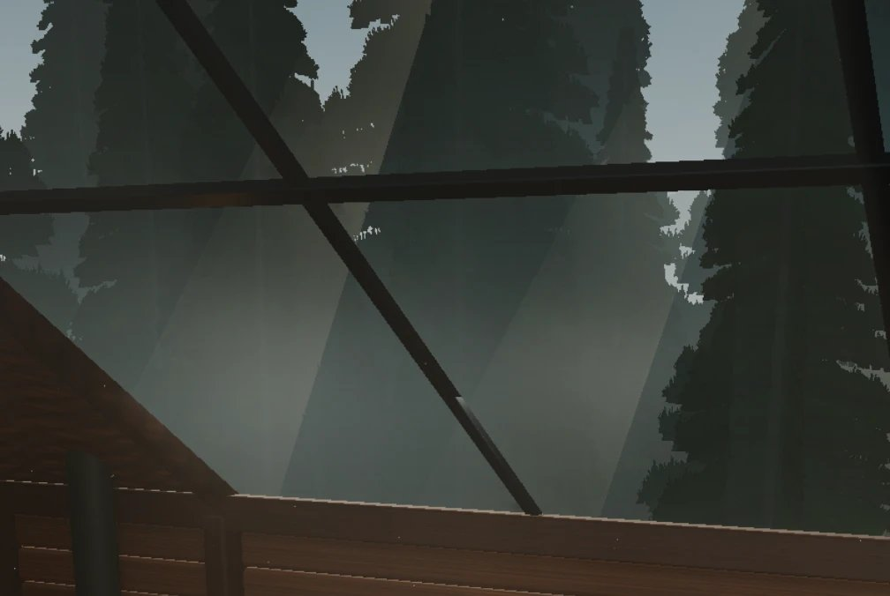
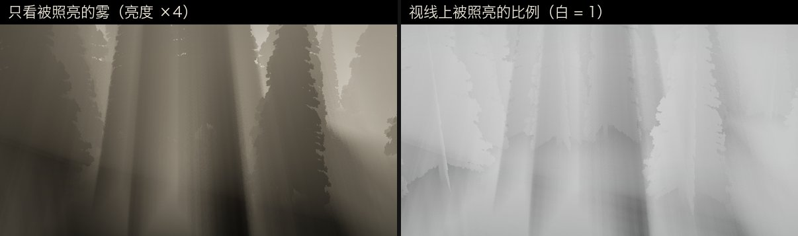
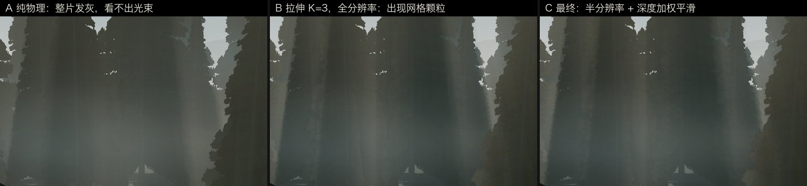
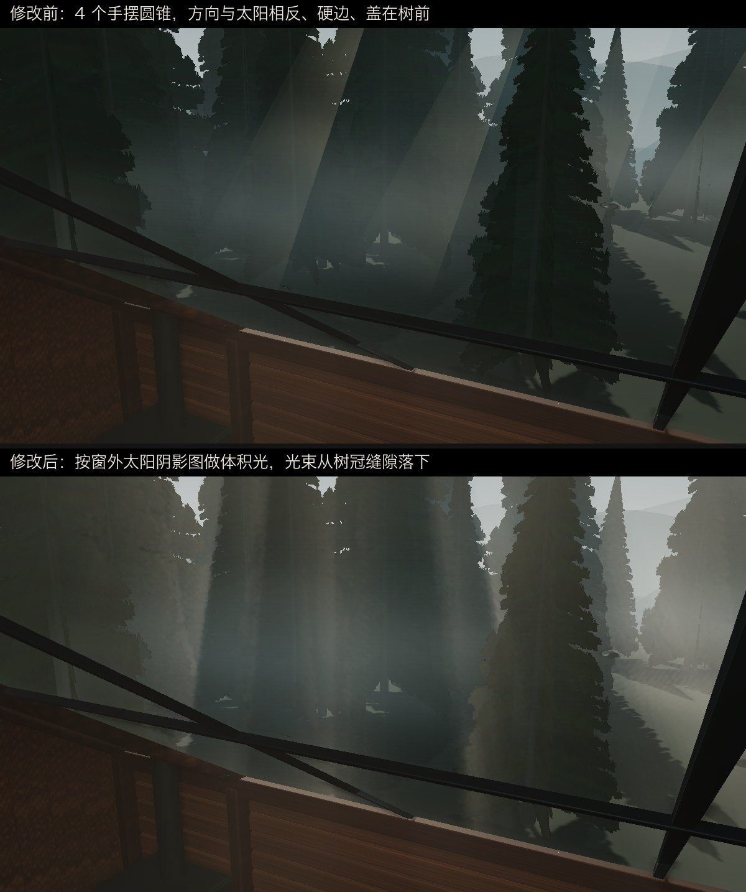
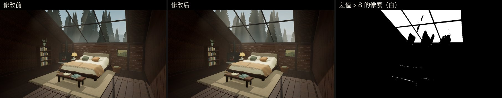

# 窗外森林渲染修复报告：树木"悬空"、玻璃方框残影与不自然的阳光

- 日期：2026-09-30
- 影响范围：只影响透过天窗看到的窗外画面。室内画面前后逐像素对比：问题 1、2 修复后，玻璃以外区域的平均差 < 0.08 / 255；问题 3 修复后，与同一版本连拍两次的抖动相同（0.137 对 0.138），见第 6 节
- 涉及文件：`src/scene.js`、`src/rain-system.js`、`src/sunlight-pass.js`、`src/morning-world.js`（源码在 `source` 分支；`main` 分支是 GitHub Pages 发布的构建产物）

## 概要

| # | 现象 | 根因 | 修复 |
|---|------|------|------|
| 1 | 透过天窗往下看，树不像长在地上 | 两盏平行光（深夜冷光、清晨太阳）的阴影相机只覆盖木屋周围约 17 m，树在 8–36 m 外。树影靠近树干的一段落在阴影相机范围外被裁掉，影子要离树根几米才出现，顶边是一条直线 | 窗外层（layer 1）改用覆盖整片森林的"孪生"平行光，室内仍用原来的紧凑阴影 |
| 2 | 玻璃上有方框、竖线、台阶状暗线 | SSAO 的法线/深度通道会透过天窗看到森林。它用的覆盖材质忽略了树叶贴图的镂空，每棵树都成了实心竖板，板子轮廓被算成暗线叠到玻璃上 | 窗外物体不参与 SSAO |
| 3 | 清晨窗外的阳光光带不自然 | 光带是手工摆放的 4 个半透明圆锥，与太阳无关：倾斜方向和太阳差 41.5°、左右相反，边缘是直线，也不被树挡 | 删掉圆锥，窗外改用与室内同一种体积光，用问题 1 新增的窗外太阳阴影贴图决定哪里有光 |

修复 1 的第一版会让木屋本身不再往窗外地面投影，最终版已补上，见 3.5 节。

## 1. 现象

用户在两个时段反馈了"透过窗户往下看外面，树不是长在地上"：


第二张截图是修复 1 上线后拍的。玻璃上成片的方框、竖线和台阶状折线仍在，这就是问题 2。

## 2. 渲染结构与排查方法

### 2.1 相关的渲染结构

- 主相机只看 layer 0，渲染室内。天窗玻璃是自定义着色器，它把窗外画面当作背景贴图 `refractionTarget` 来采样。
- 窗外画面由 `RainSystem.renderCaptures()` 里的 `backgroundCamera` 单独渲染。它只看 layer 1，内容是天空、树、地面、雾、雨，使用单独的 `exteriorFog`。
- 灯光和阴影都按相机的 layer 过滤（three.js r180）：
  - `WebGLRenderer.projectObject` 只收集 `light.layers.test(camera.layers)` 通过的灯光，阴影列表也一样。
  - `WebGLShadowMap.renderObject` 用当前渲染相机的 layers 过滤投影物体。
  - `renderer.shadowMap.autoUpdate = false`，每次 `render()` 结束后 `needsUpdate` 会被清掉。
- 最终合成顺序是 RenderPass → SSAOPass → SunlightPass → UnrealBloomPass → OutputPass。
- 问题 3 修复后：清晨有阳光时，窗外画面先画到 `exteriorTarget`，由 `ForestSunlight` 叠加窗外体积光后再写入 `refractionTarget`。

### 2.2 复现手段

- 调试构建：在源码副本里暴露 `window.__dbg`（相机、场景、合成器等），并支持 URL 参数 `cam=px,py,pz,tx,ty,tz`、`fov=`、`extonly`。正式源码不带这些钩子。
- 截图：用 headless Chrome 走 DevTools 协议（`Page.captureScreenshot`）。桌面应用内置浏览器面板隐藏时，截图不会刷新，结果不可信，所以没用它。
- 看中间结果：
  - 在帧末把 `refractionTarget` 直接画到屏幕上，看窗外层本身；
  - 设 `SSAOPass.output = 1`，看 SSAO 缓冲；
  - 把 `reflectionMap`、`heightMap`、`clearedMap` 换成 1×1 黑色贴图，逐项关掉玻璃着色器的输入。
- 固定机位：
  - `cam=1.5,6.6,1.2,-3.5,2.4,-6.5&fov=50`：从屋内高处透过天窗看向后下方；
  - `cam=0.4,5.0,-1.5,-1.1,-0.6,-12.1&fov=45`：对准一棵近处的树根；
  - `cam=1.5,6.2,1.2,-2.5,4.2,-6.5&fov=42`：透过后窗平视树林，与问题 3 的反馈截图角度一致。
- 清晨与雨量用 `time=morning`、`rain=0–100`（百分比）指定。

## 3. 问题 1：树影与树根脱开

### 3.1 先排除树的摆放

- 所有树组的 `y = -0.6`，地面平面在 `y = -0.7`，树干底端比地面高 10 cm。
- 把每棵树的根部坐标投影到屏幕上，和渲染结果对照。例如 14 号树位于 (-8.5, -0.6, -19)，投影到 (686, 270)，渲染图里它的树干正好在这里结束。
- 结论：摆放是对的。10 cm 在正常视距下约 0.3°，看不出来。

### 3.2 根因

| 光源 | 阴影相机范围 | 中心 | 贴图 |
|------|------|------|------|
| 冷光（深夜主光，强度 2.1） | left/right ±8，top 9，bottom −8 | 原点，光源在 (−2, 12, −9) | 2048² |
| 太阳（清晨） | ±9 | (0.3, 0.5, −0.5) | 2048² |

阴影相机范围之外的点一律当作受光。树冠在光空间里能投进这个范围，但树干附近的地面在范围外。结果地面上只剩范围内的那一段影子：它和树根之间隔着一段亮地，靠树一侧是一条直线。深夜冷光最强，所以最明显。

### 3.3 验证根因

临时把两个阴影相机都放大到 ±45 m，所有影子都从树根开始了：


### 3.4 为什么不直接放大原有阴影

窗框金属条宽 9 cm。现在 2048² 贴图覆盖约 18 m，每个像素约 0.9 cm，窗框投在床上的光斑边缘很清楚。如果覆盖整片森林（约 70 m），每个像素约 3.4 cm，室内光斑会明显变糊。所以室内和窗外分开处理。

### 3.5 修复

`scene.js` 新增 `buildExteriorShadows()`：

- 原来的冷光和太阳执行 `layers.disable(1)`，只照室内；
- 各建一盏只在 layer 1 的孪生平行光，只照窗外。孪生光方向与原光相同，目标点在 (0, 0, −8)，距离 70 m；
- 阴影相机取 `left −36 / right 32 / top 36 / bottom −28 / near 20 / far 100`。这是把树木分布范围（x ∈ [−24.5, 24.5]，z ∈ [−36, 13]，高度到 20 m）按两种光的方向投到光空间后算出的包围盒；
- 贴图桌面 2048²，手机 1024²，每个像素约 3.3 cm。`bias −0.0005`、`normalBias 0.12`，按更大的像素尺寸放宽；
- 每帧把颜色和强度从原光同步过来。原光 `shadow.needsUpdate` 置位时，孪生光也一起置位。

`rain-system.js` 的 `renderCaptures()` 负责刷新阴影：

- 原逻辑在 `shadowMap.needsUpdate` 时先用主相机渲一遍，目的是用室内物体刷新阴影贴图；
- 孪生光只在 layer 1 上，主相机看不到它，它的阴影贴图不会被刷新；
- 第一版的做法是在窗外那次渲染前恢复刷新标记。但那次渲染只看 layer 1，木屋（layer 0）不会画进孪生光的阴影贴图，窗外地面上木屋自己的影子就没了；
- 最终版改成用一台同时看 layer 0 和 layer 1 的 `shadowCamera` 做这次刷新渲染。所有阴影贴图（室内光和孪生光）都用全部投影物体一起刷新，木屋的影子回来了。这次渲染的输出会被随后的窗外渲染完整覆盖，不影响画面。


修复前后：


## 4. 问题 2：玻璃上的方框与台阶状暗线

### 4.1 一次错误判断

第一轮排查时，我没做验证就把这些线条归为"室内陈设在玻璃上的反光"。用户第二次反馈后逐项排除，才发现这个判断是错的。这里记录下来，作为"下结论前先复现"的反例。

### 4.2 逐项排除

同一机位（清晨中雨），画面做了对比度增强：

| 条件 | 线条 |
|------|------|
| A 正常 | 有 |
| B `reflectionMap` 换成黑色贴图（关掉反射） | 有 |
| C `heightMap` 和 `clearedMap` 换成黑色贴图（关掉水珠、水痕、擦雾） | 有 |
| D 只看 `refractionTarget`（窗外背景图） | 无 |
| E 禁用 SSAOPass | 无 |


窗外背景图里没有线条，禁用 SSAO 后线条消失，说明线条是合成阶段由 SSAO 加上去的。

### 4.3 根因

- SSAO 的法线/深度通道经过 `renderOpaque()`，玻璃和透明物体会被隐藏，所以 SSAO 能透过天窗看到窗外物体。
- `SSAOPass` 用 `scene.overrideMaterial = MeshNormalMaterial` 渲染，不认贴图和 `alphaTest`。每棵树由 3 张交叉的平面组成，宽 0.47 倍树高、高 1 倍树高，在 SSAO 眼里都是实心长方形。
- SSAO 把这些长方形的轮廓和交叉线算成遮蔽暗线，再乘到最终画面上，玻璃像素也包括在内。

SSAO 缓冲图可以直接看到"一排实心竖板"：


### 4.4 修复

- `scene.js` 初始化时，把所有启用了 layer 1 的网格加入 `ambientOcclusionExcluded`，SSAO 渲染期间把它们隐藏。
- 窗外只通过玻璃自己的背景图显示，本来就不需要室内的环境光遮蔽。
- 隐藏后，玻璃区域的深度为背景值 1.0，three.js 的 `SSAOShader` 对背景直接输出 1.0（源码注释："don't influence background"），不再压暗。
- SunlightPass 也复用这份深度（桌面复用 SSAO 深度，手机走 `renderOpaque`）。它的光线步进被限制在房间包围盒和屋顶平面内，窗外深度不影响结果。下面的室内对比也验证了这一点。


## 5. 问题 3：窗外阳光不自然

### 5.1 现象

用户反馈"感觉这个太阳光不是很自然"：



复现条件是清晨、雨停（`time=morning&rain=0`）。在 2.2 节第三个机位下，画面和截图一致：几道半透明的宽光带从右上斜向左下，边缘是直线，直接盖在树冠前面。

### 5.2 根因

窗外这几道光不是光照算出来的，而是 `morning-world.js` 里 `createLightShafts()` 手工摆的 4 个开口圆锥：`CylinderGeometry(0.15, 1.45, 15)`，加法混合，强度为 `morning × sunlight`。它们和场景里的太阳没有关联，三个问题都出在这里：

| 问题 | 证据 |
|------|------|
| 方向不对 | 圆锥细端朝向 (0.296, 0.907, −0.301)，太阳方向是 (−0.335, 0.743, −0.580)，两者夹角 41.5°，x 分量符号相反。于是光带从右上斜到左下；而同一画面里地上的树影朝右下，说明光应该从左上方照下来 |
| 边缘太硬 | 着色器按圆锥周向的 uv 取 `sin²(πu)` 作透明度，轮廓处不为零；圆锥双面渲染，前后两层在轮廓处叠出一条直边 |
| 不受遮挡 | 圆锥只做深度测试，不查阴影贴图。光带均匀穿过树冠，悬在树前，下端在半空中淡出 |

室内的光柱没有这个问题：`SunlightPass` 沿视线逐点查太阳阴影贴图，光柱形状来自真实的天窗和窗框。

### 5.3 修复思路

窗外改用和室内同一种体积光：沿视线步进，只有太阳阴影贴图照到的雾才发光。问题 1 新增的窗外孪生太阳光正好有一张覆盖整片森林的阴影贴图（每像素约 3.3 cm），可以直接复用。这样光束的方向、从哪个树冠缝隙落下、被哪棵树挡住，都由真实的太阳和树决定，也和室内光柱、地上树影一致。

### 5.4 实现

`sunlight-pass.js`：

- 把原来的室内着色器拆成两部分：公共部分（噪声、`sunVisibility`、`viewRay`、`roomSpan`、`forwardScattering`）和室内主函数。室内计算逻辑不变，第 6 节有逐像素验证。
- 新增 `ForestSunlight`，分两趟渲染：
  1. **步进（半分辨率）**：
     - 起点是视线离开房间包围盒和屋顶平面的位置，也就是室内那一趟停下的地方，同一段视线不会被照两次；终点是可见表面，最远 48 m。
     - 桌面 28 步，手机 16 步。步长按平方分布，靠近玻璃处更密，每个样本按它代表的线段长度加权。
     - 雾的密度随高度指数衰减（尺度 7 m），叠加缓慢漂移的噪声，再乘窗外雾 `FogExp2` 的透射率 `exp(−(ρd)²)`，远处的光束会淡进晨雾里。
     - 输出三项：被照亮的雾量 `lit`、雾的总量 `total`，以及表面距离。
  2. **合成（全分辨率）**：
     - 在半分辨率结果上取 3×3 邻域平均，权重同时看空间距离和表面距离是否接近，所以天空和树干交界处不会串光。
     - 算出 `scattered = total × (lit / total)³`，乘以太阳颜色、前向散射和清晨强度，加到窗外画面上。
- 阴影贴图范围外的点按受光处理，室内版则按不受光处理。

`rain-system.js`：新增 `exteriorTarget`，是 HalfFloat 颜色加一张深度贴图。

- 启用窗外后处理时，森林先画到这里，再由 `ForestSunlight` 合成进玻璃采样的 `refractionTarget`。
- 不启用时（深夜、阴雨）仍然直接画进 `refractionTarget`，和原来的路径相同。
- `exteriorTarget` 在第一次使用时才分配显存。

`morning-world.js`：删除 `createLightShafts()` 和它的 uniform 更新。

`scene.js`：创建 `ForestSunlight` 并绑定窗外孪生太阳。每帧同步三项参数：强度（与室内体积光相同，都是 `morning × sunlight`）、时间和窗外雾密度。

### 5.5 为什么要做"拉伸"

第一版完全按物理累加，整片林子发灰，看不出光束。把中间结果拆开看：



- 左图单看被照亮的雾，光束结构很清楚，都是真实树影切出来的。
- 右图是每条视线上被照亮的比例，几乎处处在 0.7–0.9。这片林子比较稀，地面大多晒得到太阳，视线穿过的空气也大多是亮的。光束和树影之间只差两三成，叠到画面上就只剩一层雾。

所以合成时对"被照亮的比例"取 3 次方：几乎全亮的视线基本不变，被树影切过的视线变暗。光束的位置和方向仍然完全来自阴影贴图，但这一步是有意的非物理调整，指数可以通过 `new ForestSunlight({ contrast })` 调。

在全分辨率下每像素抖动步进 24 步时，拉伸会把采样噪声放大成网格状颗粒（下图 B）。改成半分辨率步进加深度加权平滑后，颗粒消失，树的轮廓也没有漏光（C）：



修复前后（同一机位，清晨雨停）：



## 6. 验证

- 室内回归：默认"环顾小屋"机位，修复前后逐像素对比（0–255 灰度差的平均值）：

  | 场景 | 玻璃以外 | 玻璃区域 |
  |------|---------|---------|
  | 清晨小雨 | 0.079 | 0.31 |
  | 深夜中雨 | 0.059 | 1.0 |

  玻璃区域的差异来自去掉的暗线、新接上的树影，以及雨丝动画的随机性。窗框光斑、体积光、室内环境光遮蔽都不变。

  

- 覆盖场景：深夜雨量 58；清晨雨量 5、20、58、90。
- 问题 3 的回归（数值同上，是 0–255 灰度差的平均值；"连拍"指同一版本前后截两次，用来衡量雨丝、树影摆动等动画本身的抖动）：

  | 对比 | 区域 | 平均差 | 差值 > 8 的像素 |
  |------|------|--------|-----------------|
  | 深夜雨停，修改前 vs 修改后 | 全画面 | 0.064 | 0.01% |
  | 清晨雨停，修改前连拍两次 | 玻璃以下 | 0.138 | 0.12% |
  | 清晨雨停，修改前 vs 修改后 | 玻璃以下 | 0.137 | 0.16% |
  | 清晨雨停，修改前 vs 修改后 | 全画面 | 3.86 | 16.1%，全部在玻璃区域 |

  

- 问题 3 的其他检查：
  - 从深夜切到清晨再切回，每 0.5 s 记录一次：窗外光雾强度随清晨程度平滑变化（0.04 → 1 → 0），入夜后自动关闭，全程 `gl.getError()` 为 0。
  - 清晨雨量 30 时强度为 0.53，光束变淡，但仍和雨同时出现；雨量 58 时没有阳光，光雾关闭，和修改前一样没有光带。
  - 机位覆盖：高处看后窗、透过后窗平视、躺在床上仰看天窗、默认"环顾小屋"。
- `npm run check` 通过。正式构建在 headless Chrome 中加载，没有控制台错误或着色器错误。

## 7. 性能与资源

- 新增 2 张阴影贴图：桌面 2048²，手机 1024²。按 RGBA8 颜色加 24 位深度估算，桌面每张约 32 MB 显存（估算值，没有实测）。
- 刷新频率与原光一致：冷光的孪生光只在启动时画一次；太阳的孪生光在晴朗清晨随太阳每 0.65 s 刷新一次。刷新时投影物体主要是 62 棵树的叶片平面。
- SSAO 的法线通道少画了窗外物体，略有减负。
- 窗外体积光（问题 3）：
  - 耗时：在 headless Chrome（Apple GPU）中测，画布 1600×913。同一构建内开、关各 4 轮，每轮 40 帧，用 `readPixels` 等 GPU 做完再计时。结果每帧 7.1 → 7.8 ms，多 0.65 ms。只在清晨有阳光时运行。
  - 显存：新增 `exteriorTarget`（RGBA16F 加 32 位深度，每像素 12 B）和像素数为其四分之一的 `hazeTarget`（RGBA16F）。1600×913 约 20 MB；1080p 全屏、像素比 1.65（3168×1782）约 79 MB。这是估算值，而且只在第一次进入清晨后才分配。

## 8. 遗留与建议

- 树根比地面高 10 cm（`y = -0.6` 对 `-0.7`）。影子接上之后看不出来，这次没改。要彻底消除，可以把树组下沉到 `-0.7`。
- 树仍然是 3 张交叉的平面，地面是纯色平面。近距离俯视仍能看出"纸片感"，可以考虑给树根加接触阴影，给地面加草或落叶细节。
- 窗外画面只包含 layer 1。凡是 layer 0 物体参与的全屏后处理，今后新增时都要注意会不会"透过玻璃"作用到窗外。
- 窗外体积光的拉伸指数 3、雾高度尺度 7 m、密度 0.03，都是按现在林子的疏密调出来的观感参数。以后如果把林子加密，应先把指数调回 1 左右，再重新看效果。
- `exteriorTarget` 是为了让体积光读到窗外深度而多出的一整张全分辨率图。显存紧张时，可以改为给 `refractionTarget` 挂深度贴图，合成时用加法混合直接写回；代价是树的轮廓处可能出现 1 像素的亮边。

## 附录：代码改动

完整 diff 见 `source` 分支上的对应提交：问题 1、2 在 "Ground the forest seen through the skylight"，问题 3 在 "Light the forest haze from the real sun"。下面是摘录。

```diff
--- a/src/scene.js
+++ b/src/scene.js
@@ const atmosphereUniforms = [];
+const exteriorShadowLights = [];
@@ function lighting() { … }
+// The room's directional shadow maps hug the cabin so the skylight frame stays sharp, which clipped every tree
+// shadow a few metres short of its trunk and left the trees floating. The forest behind the glass (layer 1) is
+// lit by wide-frustum twins of those lights instead, so each shadow starts at the base of its own tree.
+function buildExteriorShadows() {
+  const forest = new THREE.Object3D();
+  forest.position.set(0, 0, -8);
+  scene.add(forest);
+  for (const light of [coolLight, morningWorld.sun]) {
+    light.layers.disable(1);
+    const twin = new THREE.DirectionalLight(light.color, light.intensity);
+    twin.layers.set(1);
+    twin.target = forest;
+    twin.position.subVectors(light.position, light.target.position).setLength(70).add(forest.position);
+    twin.castShadow = true;
+    twin.shadow.mapSize.setScalar(mobile ? 1024 : 2048);
+    Object.assign(twin.shadow.camera, { left: -36, right: 32, top: 36, bottom: -28, near: 20, far: 100 });
+    twin.shadow.bias = -0.0005;
+    twin.shadow.normalBias = 0.12;
+    scene.add(twin);
+    exteriorShadowLights.push({ light, twin });
+  }
+}
@@ function animate() {
+  exteriorShadowLights.forEach(({ light, twin }) => {
+    twin.color.copy(light.color);
+    twin.intensity = light.intensity;
+    if (light.shadow.needsUpdate) twin.shadow.needsUpdate = true;
+  });
   rainSystem.renderCaptures(camera);
@@ function init() {
   morningWorld = new MorningWorld({ scene, trees, mobile, roofHeight, reducedMotion });
+  buildExteriorShadows();
   scene.traverse(object => {
@@
-    if (object.isMesh && object.material?.transparent) ambientOcclusionExcluded.push(object);
+    // The forest (layer 1) is only ever seen through the glass's own capture. SSAO's override material ignores the
+    // needles' alpha cutout, so left in it the trees become solid cards whose outlines get darkened onto the glass.
+    if (object.isMesh && (object.material?.transparent || object.layers.isEnabled(1))) ambientOcclusionExcluded.push(object);

--- a/src/rain-system.js
+++ b/src/rain-system.js
@@ constructor
     this.backgroundCamera.layers.set(1);
+    this.shadowCamera = new THREE.PerspectiveCamera();
@@ renderCaptures(camera) {
-    if (this.renderer.shadowMap.needsUpdate) this.renderer.render(this.scene, camera);
+    if (this.renderer.shadowMap.needsUpdate) {
+      // Refresh every shadow map from a camera that sees both layers: the room's lights keep their casters, and the
+      // forest's own lights (layer 1 only) still get the cabin as a caster instead of just the trees.
+      this.shadowCamera.copy(camera);
+      this.shadowCamera.layers.enable(1);
+      this.renderer.render(this.scene, this.shadowCamera);
+    }
```

问题 3：

```diff
--- a/src/morning-world.js
+++ b/src/morning-world.js
-    this.createLightShafts();
-  createLightShafts() { … 4 个 CylinderGeometry(0.15, 1.45, 15) 加法混合光锥 … }
-    this.shaftUniforms.strength.value = morning * profile.sunlight;
-    this.shaftUniforms.time.value = time;

--- a/src/rain-system.js
+++ b/src/rain-system.js
@@ constructor
+    // While an exterior pass (the morning haze) still has to be layered over the forest, the forest is drawn here
+    // first so that pass can read its depth; its GPU storage is only allocated the first time that happens.
+    this.exteriorTarget = new THREE.WebGLRenderTarget(1, 1, { type: THREE.HalfFloatType, depthTexture: new THREE.DepthTexture(1, 1) });
+    this.exteriorPass = null;
@@ renderCaptures(camera) {
-    this.renderer.setRenderTarget(this.refractionTarget);
+    const exteriorPass = this.exteriorPass?.enabled ? this.exteriorPass : null;
+    this.renderer.setRenderTarget(exteriorPass ? this.exteriorTarget : this.refractionTarget);
@@
       this.renderer.render(this.scene, this.backgroundCamera);
     } finally {
       this.scene.fog = interiorFog;
     }
+    exteriorPass?.render(this.renderer, this.exteriorTarget, this.refractionTarget, this.backgroundCamera);

--- a/src/scene.js
+++ b/src/scene.js
@@ function animate() {
+  forestSunlight.strength = sunlight.strength;
+  forestSunlight.time = time;
+  forestSunlight.fogDensity = rainSystem.exteriorFog.density;
+  forestSunlight.enabled = forestSunlight.strength > .002 && forestSunlight.ready;
@@ function init() {
   buildExteriorShadows();
+  forestSunlight = new ForestSunlight({
+    sun: exteriorShadowLights.find(({ light }) => light === morningWorld.sun).twin, steps: mobile ? 16 : 28
+  });
+  rainSystem.exteriorPass = forestSunlight;
```

`src/sunlight-pass.js` 新增的 `ForestSunlight`（步进与合成两个着色器）较长，见提交。
